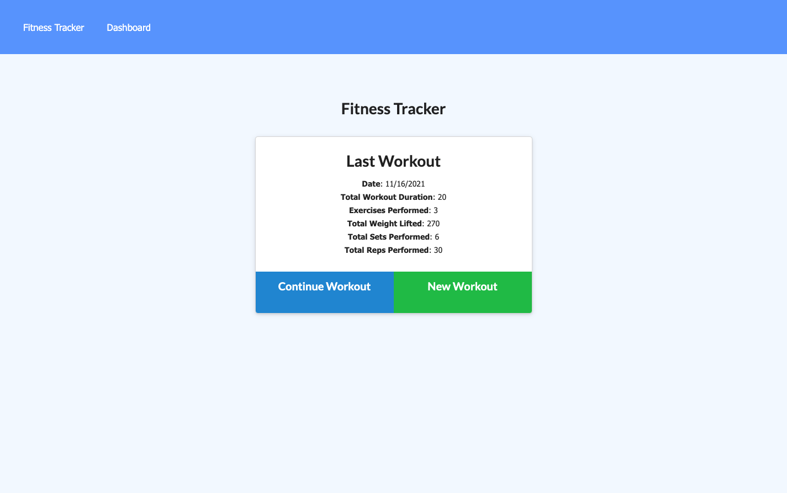

# homework-18
# Fitness Tracker

### The assignment was to crate a workout tracker that would allow you to create a workout by choosing between resistance and cardio workouts. When resistance is chosen, you build exercises by naming them and then adding weight, reps, sets, and length of time. When cardio is chosen, you name the cardio work you are doing, the distance covered, and the time it took for the exercise. When you look at the dashboard, you can view charts for the amount of time you worked out, and for the amount of weight lifted during a workout. 

## Packages, APIs, etc.
### We installed express, mongoose, and morgan for this application. In order to deploy on Heroku, the database was connected through MongoDB Atlas. 

## Contributions 
### We were given some starter code. I got some help from my tutor, Ben Abbott, for the routes. Chuck Stephens gave me some help in suggesting I create an index.js for the models. There may have been others in the zoom who said something, but it is just as likely I suggested something to them with this assignment if I was ahead of them. 

## The application has an MIT License. 

[The application is deployed here](https://hw18workouttracker.herokuapp.com)

